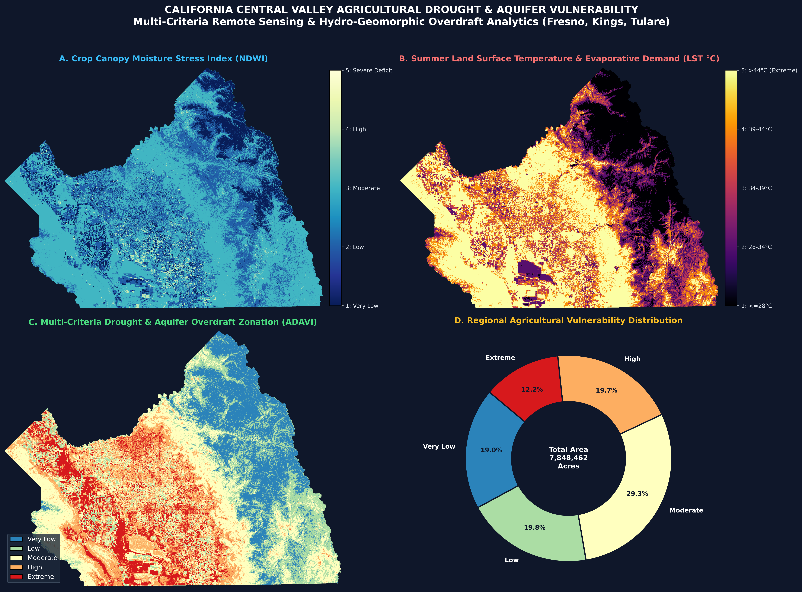
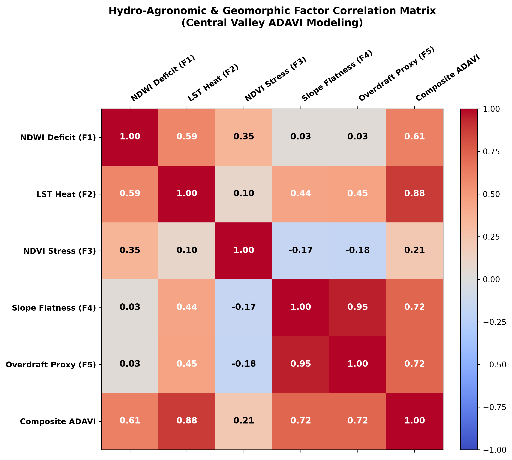
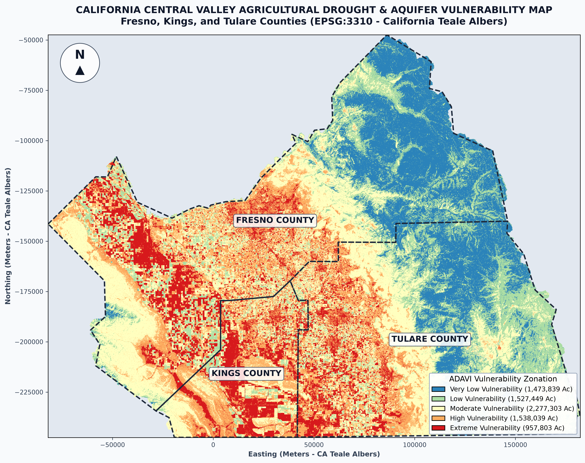

# California Central Valley Agricultural Drought & Aquifer Overdraft Modeling

<div align="center">

[](https://www.python.org/)
[](https://earthengine.google.com/)
[](https://geopandas.org/)
[](https://rasterio.readthedocs.io/)
[](LICENSE)
[]()

**A Multi-Criteria Geospatial & Remote Sensing Framework (ADAVI) for Monitoring Crop Water Deficits, Land Surface Temperatures, and Deep Aquifer Overdraft across Fresno, Kings, and Tulare Counties, California.**

</div>

---

## 📌 Executive 4-Panel Overview Dashboard

<div align="center">
  
</div>

---

## 📖 Table of Contents
- [1. Background & Problem Statement](#1-background--problem-statement)
- [2. Multi-Factor Modeling Architecture (ADAVI)](#2-multi-factor-modeling-architecture-adavi)
- [3. Key Analytical Findings & County Zonal Statistics](#3-key-analytical-findings--county-zonal-statistics)
- [4. Priority Groundwater Mitigation & Flood-MAR Siting](#4-priority-groundwater-mitigation--flood-mar-siting)
- [5. Repository Structure](#5-repository-structure)
- [6. Quickstart & Installation](#6-quickstart--installation)
- [7. Tech Stack & Data Sources](#7-tech-stack--data-sources)
- [8. License & Attribution](#8-license--attribution)

---

## 1. Background & Problem Statement

California's **Central Valley** (specifically the San Joaquin Valley and Tulare Lake Basin) is the nation's premier agricultural engine, producing over 25% of U.S. food supply. However, recurrent megadroughts, surface water cutbacks from the Central Valley Project (CVP) and State Water Project (SWP), and intensive agricultural groundwater pumping have caused:
- Severe crop canopy water deficits and thermal evaporative stress.
- Chronic groundwater table decline and unconfined/confined aquifer depletion.
- Inelastic land subsidence and structural pore collapse in deep alluvial clays (Corcoran Clay).

Under California's **Sustainable Groundwater Management Act (SGMA)**, Groundwater Sustainability Agencies (GSAs) require spatial decision support tools to identify severe stress corridors, regulate extraction, and site **Managed Aquifer Recharge (Flood-MAR)** projects.

---

## 2. Multi-Factor Modeling Architecture (ADAVI)

The **Agricultural Drought & Aquifer Vulnerability Index (ADAVI)** standardizes five remote sensing and hydro-geomorphic factor rasters onto a continuous 1–5 vulnerability scale at **100-meter resolution (EPSG:3310 - California Teale Albers)**:

$$\text{ADAVI} = \sum_{i=1}^{5} (w_i \times F_i)$$

$$\text{ADAVI} = 0.30 \times F_{\text{NDWI}} + 0.25 \times F_{\text{LST}} + 0.20 \times F_{\text{NDVI}} + 0.15 \times F_{\text{Slope}} + 0.10 \times F_{\text{Overdraft}}$$

<div align="center">
  
</div>

### Factor Calibration & Agronomic Rationale:

| Factor | Parameter & Source | Weight ($w_i$) | Agronomic & Hydro-Geomorphic Rationale | 1–5 Reclassification Scale |
| :--- | :--- | :---: | :--- | :--- |
| **$F_1$** | **Crop Canopy Moisture Deficit (NDWI)** *(Landsat 8/9 NIR/SWIR)* | **30%** | Measures leaf canopy moisture and irrigation stress; desiccation indicates acute water deficit. | **1:** $>0.20$ (Moist)<br>**5:** $\le -0.25$ (Severe Deficit) |
| **$F_2$** | **Thermal Stress & Evaporative Demand (LST °C)** *(Landsat 8/9 TIRS)* | **25%** | Captures surface heat anomalies and high evapotranspiration demand on non-transpiring canopies. | **1:** $\le 28^\circ\text{C}$<br>**5:** $>44^\circ\text{C}$ (Extreme Heat) |
| **$F_3$** | **Vegetation Biomass & Crop Health (NDVI)** *(Landsat 8/9 Red/NIR)* | **20%** | Quantifies photosynthetic vigor and distinguishes healthy orchards from fallowed/abandoned fields. | **1:** $>0.60$ (Vigorous)<br>**5:** $\le 0.15$ (Fallowed/Bare) |
| **$F_4$** | **Alluvial Plain Topographic Slope** *(USGS 3DEP DEM)* | **15%** | Flatter alluvial valley floors contain thick compressible clay layers susceptible to subsidence. | **1:** $>5.0^\circ$ (Upland)<br>**5:** $\le 0.8^\circ$ (Subsidence Core) |
| **$F_5$** | **Aquifer Overdraft & Soil Compaction Proxy** *(Spatial Filter)* | **10%** | Models contiguous spatial corridors subject to continuous cones of depression. | **1:** $<1.8$<br>**5:** $\ge 4.2$ (Overdraft Core) |

---

## 3. Key Analytical Findings & County Zonal Statistics

The pipeline evaluated **7,848,462 acres (31,761.6 km²)** across the three-county study area:

| County | Total Area (Acres) | Mean ADAVI Score | Extreme (%) | High (%) | Moderate (%) | Low (%) | Very Low (%) |
| :--- | :---: | :---: | :---: | :---: | :---: | :---: | :---: |
| **Kings County** | 885,173 | **3.828 / 5.000** | **30.05%** | **37.17%** | 26.66% | 6.11% | 0.00% |
| **Tulare County** | 3,090,288 | **3.032 / 5.000** | **8.05%** | **15.59%** | 30.73% | 26.81% | 18.82% |
| **Fresno County** | 3,798,971 | **3.083 / 5.000** | **11.66%** | **19.14%** | 28.74% | 16.98% | 23.49% |
| **Regional Summary** | **7,848,462** | **3.143 / 5.000** | **12.27%** | **19.60%** | **29.22%** | **20.12%** | **18.79%** |

### Key Highlights:
- **Acute Vulnerability in Kings County:** **67.22% (595,082 acres)** of Kings County falls within High or Extreme vulnerability tiers due to severe summer heat anomalies (>42°C) and Tulare Lake basin alluvial subsidence susceptibility.
- **Regional Farmland at Risk:** **2.50 Million Acres (31.87%)** across the three counties face severe drought and overdraft risk.

---

## 4. Priority Groundwater Mitigation & Flood-MAR Siting

<div align="center">
  
</div>

Contiguous clusters of Class 4 (High) and Class 5 (Extreme) vulnerability ($\ge 50\text{ ha}$) were polygonized into:
```
03_Drought_Aquifer_Model/Priority_Groundwater_Mitigation_Zones.geojson
```
- **Total Delineated Mitigation Footprint:** **309 contiguous clusters** covering **2,378,812 acres**.
- **Actionable Applications:** Siting Managed Aquifer Recharge (MAR), voluntary land repurposing programs (MLRP), well-metering prioritization, and SGMA extraction allocations.

---

## 5. Repository Structure

```
California_Central_Valley_Drought/
├── 01_Raw_Data/                      # Co-registered raw satellite & elevation datasets
│   ├── Crop_Water_NDWI/              # 100m Landsat NDWI
│   ├── Elevation_DEM/                # 100m USGS 3DEP DEM
│   ├── Thermal_LST/                  # 100m Landsat LST (°C)
│   ├── Vegetation_NDVI/              # 100m Landsat NDVI
│   └── Boundary/                     # Fresno, Kings, Tulare county shapefiles
├── 02_Processed_Factors/             # Standardized 1-5 factor GeoTIFFs (100m, EPSG:3310)
│   ├── Factor1_Crop_Moisture_Deficit_NDWI.tif
│   ├── Factor2_Thermal_Stress_LST.tif
│   ├── Factor3_Vegetation_Biomass_NDVI.tif
│   ├── Factor4_Topographic_Slope.tif
│   └── Factor5_Aquifer_Overdraft_Proxy.tif
├── 03_Drought_Aquifer_Model/         # Model rasters, zonal statistics, and GeoJSON vectors
│   ├── ADAVI_Continuous_Index.tif    # Continuous index (1.000 to 5.000)
│   ├── ADAVI_5Class_Vulnerability.tif # 5-class classified raster
│   ├── County_Vulnerability_Statistics.csv
│   ├── County_Vulnerability_Statistics.json
│   └── Priority_Groundwater_Mitigation_Zones.geojson
├── 04_Final_Maps/                    # Publication-quality 300 DPI figures
│   ├── California_Central_Valley_Executive_4Panel.png
│   ├── California_Central_Valley_Cartographic_Map.png
│   └── Factor_Correlation_Matrix.png
├── src/
│   └── run_drought_aquifer_model.py  # Production Python CLI pipeline
├── California_Central_Valley_Drought_Model.ipynb # Interactive, fully documented Jupyter Notebook
├── California_Central_Valley_Drought_Report.md   # Comprehensive technical whitepaper
├── requirements.txt                  # Python dependencies
├── .gitignore                        # Git ignore rules
└── LICENSE                           # MIT License
```

---

## 6. Quickstart & Installation

### 1. Clone the Repository
```bash
git clone https://github.com/<your-username>/California_Central_Valley_Drought.git
cd California_Central_Valley_Drought
```

### 2. Set Up Virtual Environment & Dependencies
```bash
python -m venv venv
# On Windows:
venv\Scripts\activate
# On Linux/macOS:
source venv/bin/activate

pip install -r requirements.txt
```

### 3. Run the Automated Modeling Pipeline
```bash
python src/run_drought_aquifer_model.py
```

### 4. Open the Interactive Jupyter Notebook
```bash
jupyter notebook California_Central_Valley_Drought_Model.ipynb
```

---

## 7. Tech Stack & Data Sources

- **Cloud Earth Observation:** [Google Earth Engine (GEE)](https://earthengine.google.com/) for Landsat 8/9 surface reflectance and thermal collection extraction.
- **Geospatial & Scientific Python:** `rasterio`, `geopandas`, `shapely`, `pyproj`, `numpy`, `scipy`, `pandas`, `matplotlib`.
- **Desktop GIS:** ArcGIS Pro (`.aprx`, `.atbx`, layout cartography).
- **Data Providers:** USGS 3D Elevation Program (3DEP), USGS/NASA Landsat 8/9 OLI/TIRS, US Census Bureau TIGER/Line.

---

## 8. License & Attribution

This project is licensed under the [MIT License](LICENSE).
Feel free to use and adapt this modeling framework for academic research, water resource planning, and open-source geospatial applications.
